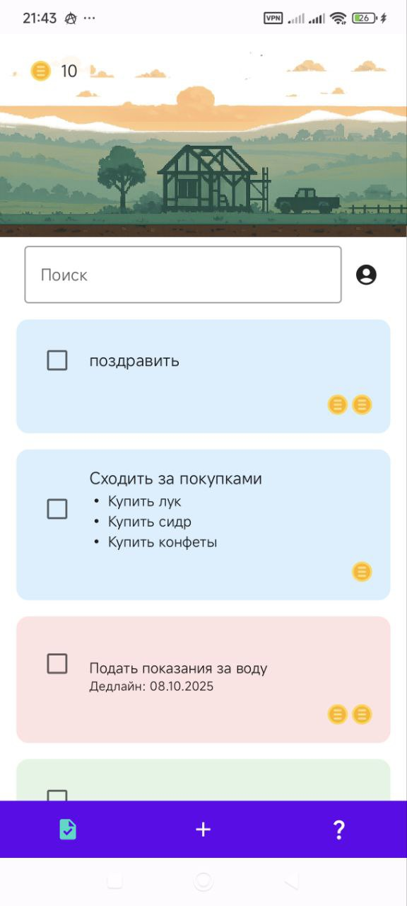
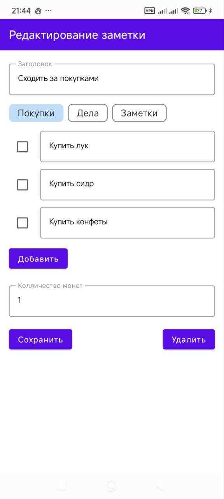
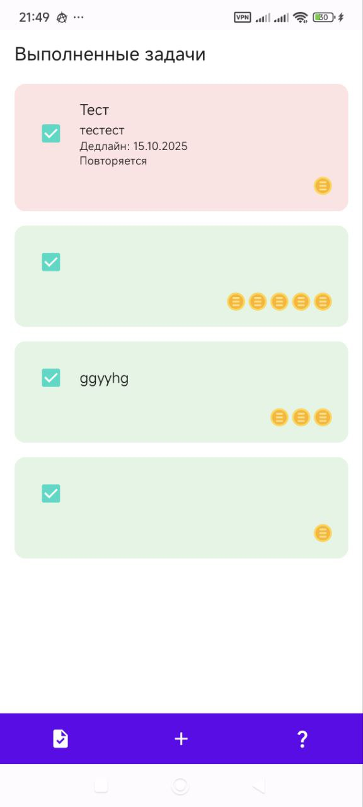
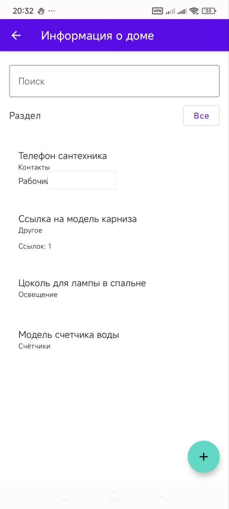

# Mutlaboc Notes

Mutlaboc Notes - Android-приложение для управления персональными заметками,
задачами, чек-листами и домашней информацией. Проект разработан как
клиент-серверная система: мобильный клиент отвечает за пользовательский
интерфейс и локальные функции, а backend хранит данные, управляет
аутентификацией и проверяет доступ к ресурсам пользователя.


## Возможности

- Регистрация и вход по email/password.
- Вход через Google и Yandex при настроенных OAuth client IDs.
- Заметки по категориям: покупки, дела, обычные заметки.
- Чек-листы с отдельными пунктами выполнения.
- Дедлайны, повтор задач и локальные уведомления Android.
- Отдельный экран выполненных задач.
- Домашние информационные карточки: счетчики, техника, освещение, документы,
  контакты и другие бытовые записи.
- Настройки темы и языка интерфейса.
- Клиент-серверное хранение данных с разграничением доступа по пользователю.

## Скриншоты

| Задачи | Чек-лист | Выполнено |
| --- | --- | --- |
|  |  |  |

| Домашняя информация | Настройки |
| --- | --- |
|  |  |

## Архитектура

Система состоит из двух репозиториев:

- `MutlabocNotes` - Android-клиент на Kotlin и Jetpack Compose.
- `notes-backend` - Ktor backend с PostgreSQL, JWT-аутентификацией и миграциями
  Flyway.

Android-приложение обращается к backend через Retrofit/OkHttp. Публичные auth
endpoint'ы используются для входа, регистрации, refresh/logout и social auth, а
защищенные API получают Bearer token через общий session store. Backend хранит
заметки, checklist items, домашние карточки, пользователей, social identities и
refresh tokens в PostgreSQL.

Подробнее устройство Android-части описано в
[ARCHITECTURE.ru.md](ARCHITECTURE.ru.md).

## Технологии

- Kotlin, Android SDK, Gradle Kotlin DSL.
- Jetpack Compose, Navigation Compose, Material Components.
- Retrofit, OkHttp, Gson.
- DataStore для пользовательских настроек.
- Room и AndroidX Security Crypto в клиентской части.
- Ktor, PostgreSQL, Exposed, HikariCP, Flyway, JWT, bcrypt в backend.
- JUnit, Compose UI tests, MockWebServer, Testcontainers.

## Быстрый запуск Android

Для локальной dev-сборки достаточно Android SDK и JDK, которые использует
Gradle toolchain. Dev flavor по умолчанию смотрит на локальный backend по адресу
`http://10.0.2.2:8080/`, что удобно для Android Emulator.

```powershell
cd D:\Projects\MutlabocNotes
.\gradlew.bat :app:assembleDevDebug
.\gradlew.bat :app:testDevDebugUnitTest
```

Для запуска вместе с backend:

```powershell
cd D:\Projects\notes-backend
.\gradlew.bat run
```

Stage/prod-сборки требуют явных значений `STAGE_BACKEND_URL`,
`PROD_BACKEND_URL`, `*_GOOGLE_WEB_CLIENT_ID` и `*_YANDEX_CLIENT_ID`. Примеры
локальной конфигурации, release signing и CI-секретов приведены в
[README_DEV.md](README_DEV.md).

## Документация

- [README_DEV.md](README_DEV.md) - локальная разработка, flavors, OAuth,
  signing и связь с backend.
- [ARCHITECTURE.ru.md](ARCHITECTURE.ru.md) - устройство Android-приложения и
  зависимостей.
- [ANDROID_TESTING.ru.md](ANDROID_TESTING.ru.md) - сценарии проверки Android.
- [RELEASE_CHECKLIST.ru.md](RELEASE_CHECKLIST.ru.md) - checklist перед релизом.
- Backend README находится в соседнем репозитории `notes-backend`.

## Статус проекта

Проект является учебным прототипом, подготовленным к публичному просмотру.
Лицензия не указана, поэтому права на использование кода не предоставляются
автоматически.
